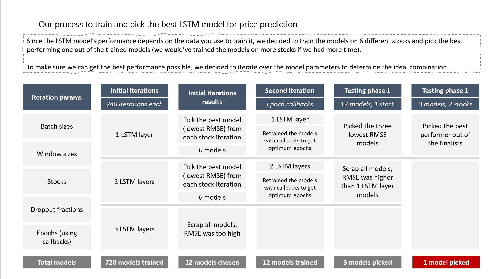
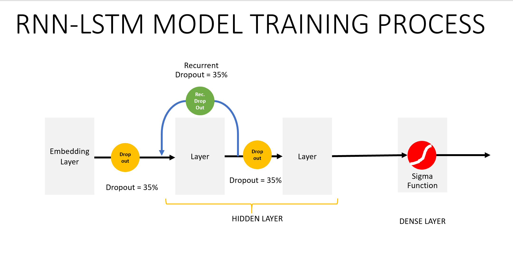
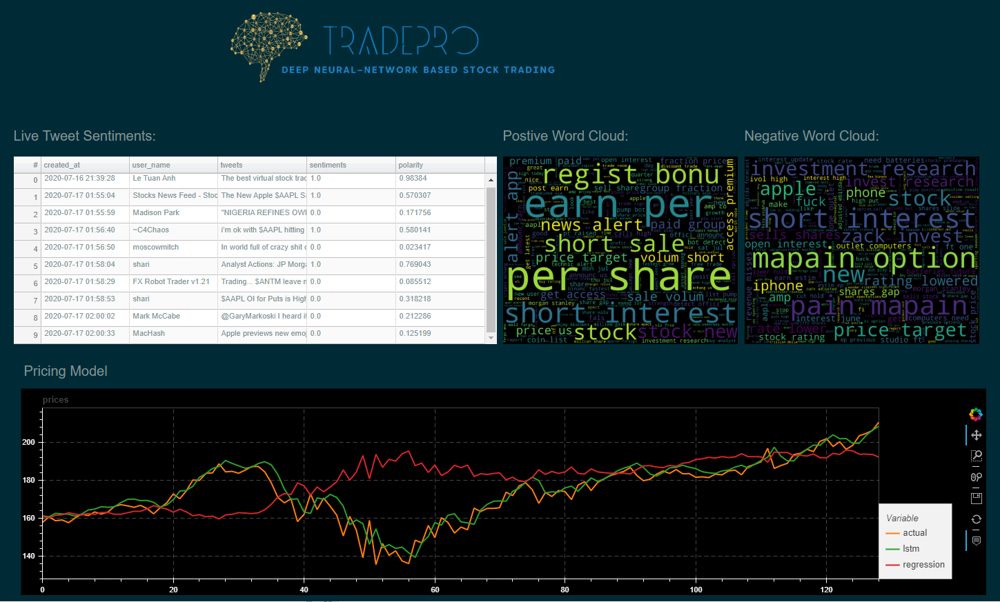
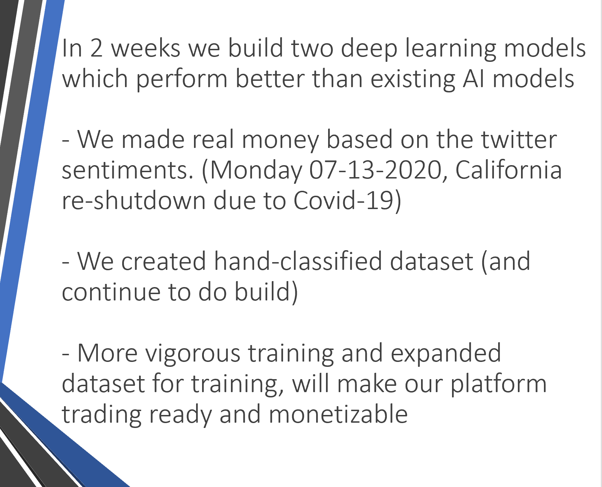

# Trading & Analysis of Stocks based on Proprietary Deep Neural Network Models

*A Deep Neural Network advisory platform that provides price signals and live proprietary financial Twitter senitments for equity trading by Shubra Bhatnagar, Toufic Lawand and Steffen Westerburger* 

## **Introduction** 

We developed a Deep Neural Network advisory platform that provides price signals and live proprietary financial Twitter senitments for equity trading.

We also compared it with the standard regression model
This is done two different and complimentary ways:

1) We designed, developed, trained and tested a long short-term memory (LSTM) model and a linear regression model. Those models enable us to make predicitions on future stock prices based on historical data.

2) We designed, developed, trained and tested a long short-term memory (LSTM) model  specifically focused on sentiment analysis of tweets on Twitter. This model is uniquely equipped to determine the sentiment of tweets that are talking about individual stocks and classifies the core message as either 'positive' or 'negative'.

These two approaches are combined in a comprehensive dashboard that gives any investor, from individual to big corporation, a powerful tool to predict developments in the stock market.

## **Technology/Platforms:** 

##### Packages used:

- pandas
- numpy
- sklearn
- nltk
- tensorflow.keras
- regex
- wordcloud
- pickle

##### APIs used

- Alpha Vantage API
- Alpaca API
- Tweepy API

##### Cloud computing service
Trained the model using Microsoft `***Azure Cloud Notebook***`(Refer to the setup guide in the `Docs` Folder.

---

### *Data and challenges we ran into during the exploration and clean up process*

- For the first part of the project we used historical stock data provided to us by the Alpaca API. We randomly selected six different stocks (MSFT, AMD, TSLA, JNJ, REGN, GILD). 

- For Sentiment Analysis we downloaded tweets and handclassified 11830 tweets

### **Model 1: Predicting stock prices using sklearn linear regression**

### **Model 2: Predicitng stock prices LSTM using Tensorflow/Keras**
add screenshot of graph and summary of findings/use

### **Model 3: Twitter sentiment analysis LSTM using Tensorflow/Keras/NLTK**
add screenshot of graph and summary of findings/use

## ** Discussion of Findings **
Evaluation of Sentiment Analyzer

# TRADING PLATFORM
---

## CONCLUSION
---

